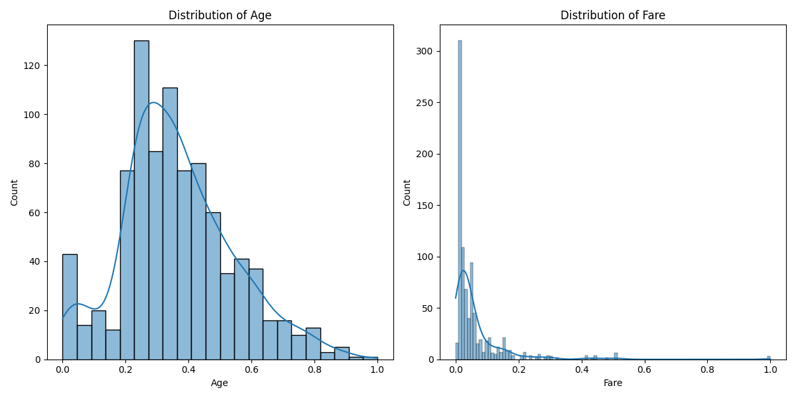
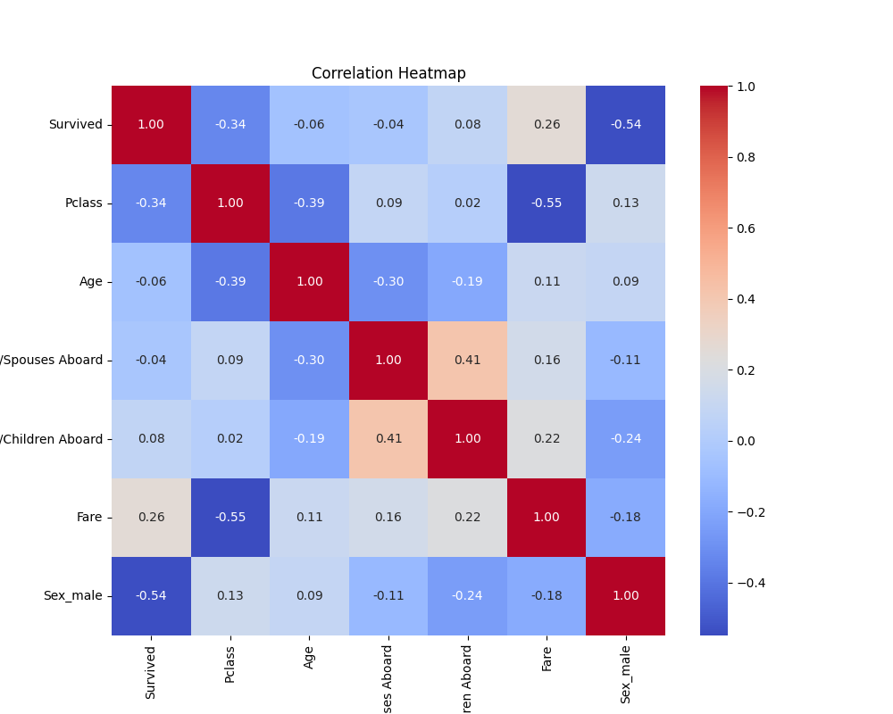
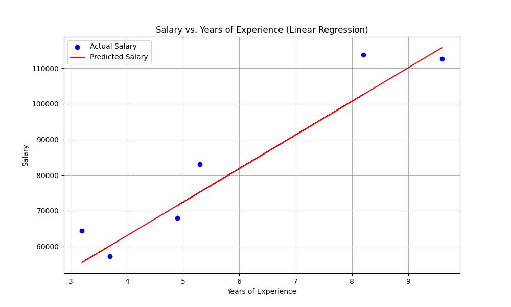
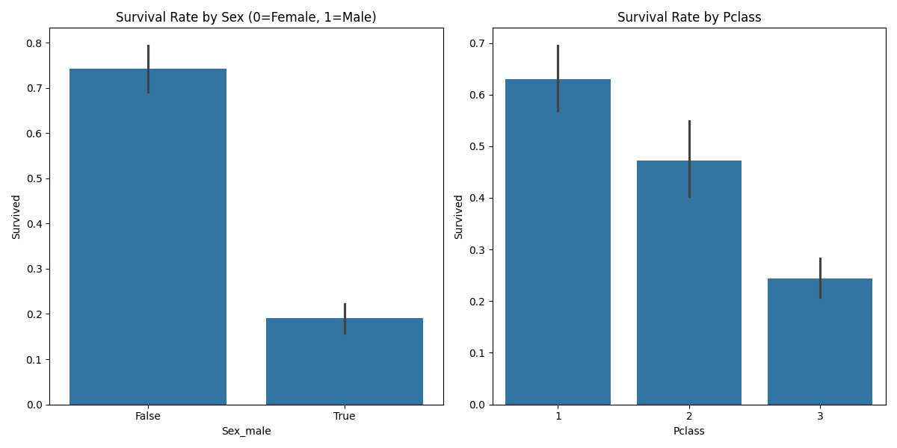

# Titanic & Salary ML Projects Dashboard






This project is a collection of three machine learning mini-projects, presented in a unified interactive dashboard using Streamlit. The tasks include data preprocessing, exploratory data analysis (EDA), and linear regression modeling, using the Titanic and Salary datasets.

---

## Project Structure

- **app.py**: Streamlit dashboard to interactively run preprocessing, EDA, and linear regression tasks.
- **task1_data_preprocessing/**: Scripts and documentation for data cleaning and preprocessing on the Titanic dataset.
- **task2_eda/**: Scripts and documentation for exploratory data analysis on the cleaned Titanic dataset.
- **task3_linear_regression/**: Scripts and documentation for building and evaluating a linear regression model on the Salary dataset.
- **cleaned_titanic.csv, titanic.csv, Salary_Data.csv**: Example datasets.
- **Various PNGs**: Visualizations generated during EDA and modeling.

---

## Tasks Overview

### 1. Data Preprocessing (Titanic)

- Cleans the Titanic dataset by handling missing values, dropping irrelevant columns, encoding categorical variables, and normalizing features.
- Output: `cleaned_titanic.csv`
- Script: `task1_data_preprocessing/preprocess_titanic.py`

### 2. Exploratory Data Analysis (EDA)


- Loads the cleaned Titanic data and provides:
  - Data overview and statistics
  - Visualizations: Age/Fare distributions, survival rates by sex/class, correlation heatmap
- Script: `task2_eda/eda_titanic.py`

### 3. Linear Regression (Salary Prediction)

- Uses the Salary dataset to build a simple linear regression model predicting salary from years of experience.
- Evaluates model with MSE and R², and visualizes predictions.
- Script: `task3_linear_regression/linear_regression.py`

---

## How to Run

1. **Install requirements**:
   ```bash
   pip install streamlit pandas scikit-learn matplotlib seaborn
   ```
2. **Start the dashboard**:
   ```bash
   streamlit run app.py
   ```
3. **Follow the sidebar to navigate between Preprocessing, EDA, and Linear Regression. Upload the required CSV files as prompted.**

---

## File Descriptions

- `app.py`: Main dashboard application.
- `task1_data_preprocessing/preprocess_titanic.py`: Data cleaning script for Titanic dataset.
- `task2_eda/eda_titanic.py`: EDA script for Titanic dataset.
- `task3_linear_regression/linear_regression.py`: Linear regression script for Salary dataset.
- `cleaned_titanic.csv`, `titanic.csv`, `Salary_Data.csv`: Example datasets.
- `*.png`: Plots generated by EDA and modeling scripts.

---

## Requirements

- Python 3.7+
- Streamlit
- Pandas
- scikit-learn
- Matplotlib
- Seaborn

---

## Credits

- Titanic dataset: [Kaggle Titanic](https://www.kaggle.com/c/titanic/data)
- Salary dataset: [SuperDataScience Salary Data](https://www.superdatascience.com/pages/machine-learning)

---

**Author:** Ranjith (aka lipoou)

Feel free to use, modify, and extend this project for learning and experimentation!
